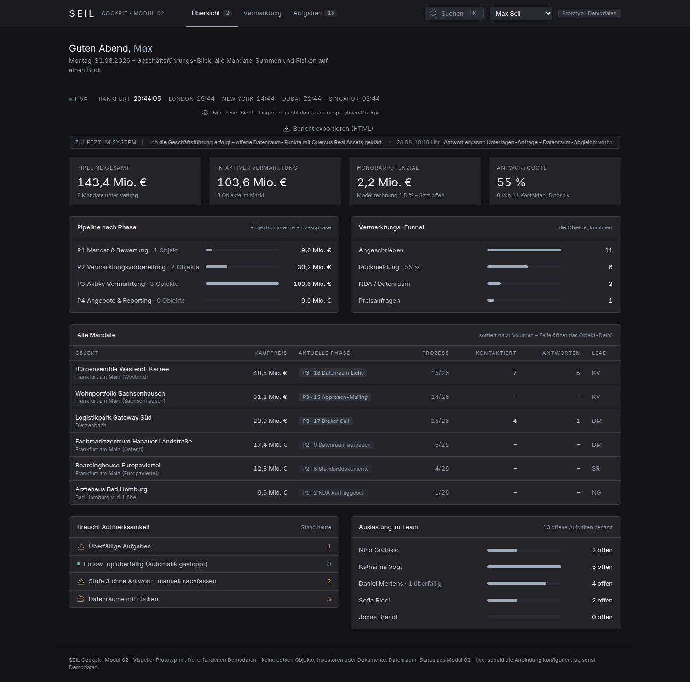

# SEIL Cockpit · Modul 02 (Prototyp)

Visueller Frontend-Prototyp (Klickdummy) für das SEIL Cockpit – das CRM-Cockpit einer
Immobilien-Transaktionsberatung. Der Prototyp dient der Abstimmung mit dem Kunden:
**keine echte Logik, keine API-Anbindung, keine Datenbank.** Alle Daten sind frei
erfundene Demodaten in [`lib/mock-data.ts`](lib/mock-data.ts).

Der Transaktionsprozess folgt der Team-Liste, bereinigt auf **26 Schritte in 4 Phasen** (Mandat & Bewertung → Vermarktungsvorbereitung → Aktive Vermarktung → Angebote & Reporting), Statusvokabular Done / In Progress / Pending / N.A. – die Bereinigungen gegenüber der Excel sind in [`ANNAHMEN.md`](ANNAHMEN.md) (Punkte 1–3) dokumentiert.

Kernidee: Objekte, Investoren und Auftraggeber sind **relational verknüpft** – jeder
Klick auf eine Entität zeigt alle verbundenen Aktivitäten, Kommunikation und
Gegenparteien. Genau das, was Pipedrive + Excel heute nicht können.

## Screens

| # | Screen | Route | Inhalt |
|---|--------|-------|--------|
| 1 | Übersicht | `/` | Laufende Transaktionen mit Phase, offene Aufgaben, Investoren ohne Rückmeldung, Datenräume mit Lücken |
| 2 | Objekt-Detail | `/objekte/[id]` | Prozessleiste über beide Seiten, Datenraum-Status (aus Modul 01), Dokumenten-Checkliste, verknüpfte Investoren, Aktivitäten |
| 3 | Investor-Detail | `/investoren/[id]` | Ankaufsprofil (Zielregionen und Ticket direkt bearbeitbar), verknüpfte Objekte, Kommunikationshistorie |
| 4 | Vermarktung | `/vermarktung` | Automatik-Kette, Investorenliste je Objekt mit Match- und Antwortstatus, Follow-up-Stufe, oben der Freigabe-Schritt (Human-in-the-Loop) |
| 5 | Aufgaben | `/aufgaben` | Nach Mitarbeiter gefiltert, Broker Calls hervorgehoben |

Die Übersicht zeigt die laufenden Transaktionen wahlweise als dichte Tabelle
oder als Board – eine Spalte je Phase („Mandat & Bewertung“ bis „Angebote &
Reporting“).

Der Klickdummy ist als **tägliches Arbeitswerkzeug** gedacht (Pipedrive-Ablösung),
nicht als Berichtsseite: Oben rechts stellt „Arbeiten als“ das Cockpit auf die
Sicht eines Mitarbeiters um (simulierte Anmeldung). Die Übersicht beginnt mit dem
persönlichen Tag – dem **Posteingang der Antworterkennung** (erkannte Antworten
mit Triage per Klick) und **Meine Aufgaben** (direkt abhakbar, synchron mit dem
Aufgaben-Screen). **⌘K / Strg+K** öffnet die globale Suche über Objekte,
Investoren und offene Aufgaben. Der Aufgaben-Screen ist ein **Kanban-Board**
(Spalten = Fälligkeit: Heute, Morgen, Später, Erledigt) – Karten lassen sich
per Drag & Drop umplanen und abhaken; die Liste bleibt als zweite Ansicht. Dazu ist der Prototyp an den im Kundentermin
gewünschten Stellen interaktiv: die Prozessleiste öffnet je Schritt ein
Detailpanel, KI-extrahierte Werte lassen sich prüfen und übernehmen, Notizen
lassen sich direkt am Objekt erfassen, Ankaufsprofile lassen sich direkt am
Investor pflegen (Zielregionen, Ticket – das Matching zieht live mit),
Aufgaben lassen sich neu zuweisen,
verschieben und abhaken, und die Vermarktung zeigt Antwortquote und
Teaser-Pipeline (KI-Entwurf → Prüfung → Versand). Alle Eingriffe gelten nur in
der laufenden Sitzung – ein Reload stellt den Demostand wieder her.

**Rollen-Sicht Geschäftsführung:** „Arbeiten als“ **Max Seil (Geschäftsführer)**
schaltet die Übersicht auf ein eigenes, **rein lesendes GF-Dashboard** –
Projektsummen (Pipeline gesamt / in aktiver Vermarktung), Honorarpotenzial
(Modellrechnung 1,5 %, Satz offen), Antwortquote, Projektsummen je Phase,
Vermarktungs-Funnel, alle Mandate nach Volumen, Risiken und Team-Auslastung.
Kein Posteingang, keine Eingaben; der GF taucht auch nicht in
Aufgaben-Filter oder -Zuweisung auf (ANNAHMEN.md, Punkt 43).

Bewegung ist bewusst dosiert – Broker-Terminal, kein Spielzeug: Auf der
Übersicht läuft ein **Aktivitäten-Ticker** (Hover pausiert), die KPI-Zahlen
zählen beim Laden hoch, die 7-Tage-Sparklines zeichnen sich, laufende
Prozessschritte pulsieren sanft, die Zähler in der Kopfleiste poppen bei
Änderungen und Seiteninhalte ziehen gestaffelt ein. Wer im Betriebssystem
„Bewegung reduzieren“ aktiviert hat, bekommt das Cockpit komplett ruhig
(`prefers-reduced-motion`, ANNAHMEN.md, Punkt 42).

Das Cockpit ist **responsiv**: Am Smartphone bricht die Kopfleiste in zwei
Zeilen, die Board-Spalten stapeln untereinander und breite Tabellen scrollen
innerhalb ihrer Karte. Weil Drag & Drop auf Touchscreens nicht existiert,
öffnet das Griff-Symbol jeder Board-Karte ein „Verschieben nach …“-Menü mit
gleicher Wirkung; die Suche öffnet mobil über das Lupen-Symbol
(ANNAHMEN.md, Punkt 41).

Objekt- und Investor-Detail sind bewusst nur über Verlinkungen erreichbar (Zeilen in
Tabellen anklicken) – es gibt keine Listen-Screens über die fünf Screens hinaus.

## Abdeckung Angebot AG2026-SEIL-03 & Kundentermin (17.08.)

| Leistungsbaustein | Im Prototyp sichtbar als |
|---|---|
| KI-personalisierte Ansprache mit Freigabe-Workflow | Freigabe-Karte (Human-in-the-Loop); Versand im Prototyp als Presound-Sammelmail – Personalisierung je Investor ist Klärungspunkt (ANNAHMEN.md, Punkt 28) |
| Szenariobasierte Follow-up-Logik (Response, Price Inquiry, kein Rücklauf) | Antwortstatus je Kontakt, Follow-up-Stufen 1–3, „manuell nachfassen“ nach Stufe 3 |
| Antwort-Erkennung und Zuordnung | Aktivitäten „Antwort erkannt: …“ + automatisch erzeugte Aufgaben (Broker Call, Rückruf durch die Geschäftsführung bei Preisanfragen) |
| Zentrales Dashboard: Phasen, Investoren, Objekte, Datenraum-Status | Die fünf Screens; Prozessleiste über beide Seiten; Datenraum aus Modul 01 |
| Pipedrive-Export/-Import (einmalig) | Quelle-Tag „Pipedrive-Import“ am Investor |
| Status-Reports an das Team | Statuszeile auf der Übersicht – Kanal bewusst offen |
| Se-Circle-Anbindung (Kundentermin; Umsetzung als Ausbaustufe) | Quelle „Se Circle“ am Objekt + Sync-Karte – simuliert (ANNAHMEN.md, Punkt 23) |
| KI liest Datenraum aus (Grundbuch, Mieterlisten) | „KI-ausgelesen“-Kennwerte in der Datenraum-Karte + Aktivitäten mit Quelle „KI“ |
| KI generiert Teaser & Listings | Aktivität „Teaser und Listing automatisch generiert – zur Prüfung“ |
| Presound-Mails an BCC-Verteiler | Benennung in Freigabe-Karte und Automatik-Zeile der Vermarktung |

Alles davon ist reine Anzeige mit Demodaten – keine echte Automation im Prototyp.

### Demo-Check 20.08. (11:30, mit Nino) – eingearbeitet

| Beschluss aus dem Meeting | Im Prototyp sichtbar als |
|---|---|
| Automatisierung des Transaktionsprozesses = oberste Priorität | **Automatik-Kette** auf der Vermarktung: Datenraum einlesen → Matching → E-Mails vorbereiten → Freigabe → Versand & Follow-ups → Antworterkennung – nur die Freigabe stoppt |
| Matching als Kernstück, Standort als erstes Kriterium | Match-Spalte im Verteiler (Standort · Klasse · Ticket, in dieser Reihenfolge); nicht volle Treffer sind als „manuell ergänzt“ markiert – die Liste bleibt offen |
| Anforderungsprofile direkt im CRM, keine externen Excel | Ankaufsprofil am Investor **editierbar** (Zielregionen, Ticket) – das Matching in der Vermarktung zieht live mit |
| Zielregionen-Rückfrage in den Follow-up-Prozess | Follow-up Stufe 2 und die Absage-Bestätigung fragen Zielregionen ab; Antworten erscheinen als „Profil-Update“ im Posteingang und aktualisieren das Profil automatisch |
| WhatsApp datenschutzkonform über Superchat | Follow-up-Kanal „E-Mail + WhatsApp (Superchat)“ in Kette und Automatik-Zeile, Superchat-Aktivitäten in der Historie |
| Backoffice übernimmt die administrative Vorbereitung | Eigene Verantwortung **Backoffice** in der 26-Schritte-Prozessleiste (Rent Roll, Standarddokumente, Datenraum-Aufbau, Fotograf); NDA-Versand als Hinweis am Schritt „NDA Vermarktung“ – das Drafting bleibt beim Legal Team |

Details und offene Punkte dazu: ANNAHMEN.md, Punkt 44.

### Update-Call 28.08. – eingearbeitet

- **Reporting als Exportprodukt:** „Bericht exportieren (HTML)“ auf der
  Übersicht und im GF-Blick erzeugt den Statusbericht als eigenständige
  HTML-Datei im SEIL-CI mit den Live-Zahlen der Sitzung – dasselbe
  HTML-Produkt, das produktiv die Automatik werktäglich 08:00 versendet.
- **Server-Migration beschlossen:** Die n8n-Automatik zieht in die Domain
  der SEIL Group; Live-Gang erst nach Office-365-/Tenant-Migration durch
  den neuen IT-Dienstleister (siehe `automation/n8n/README.md`).
- **Workshop nach Live-Gang:** NDA-Handling, Datenraum-Freigaben und
  Broker-Benachrichtigungen werden dort als Erweiterungen der
  Automatik-Kette feinabgestimmt (ANNAHMEN.md, Punkt 48).

**Scope-Abgrenzung (Projektstand 28.08.):** Die Se-Circle-Anbindung sowie
Investoren-Profilanreicherung und automatisches Matching sind produktiv als
**Ausbaustufe** vorgesehen und nicht Teil der 8-Wochen-Umsetzung – der Prototyp
zeigt sie auf Wunsch aus dem Demo-Check als Zielzustand, entsprechend
gekennzeichnet. Der vertragliche Kickoff-Workshop zu Modul 02 steht noch aus;
die 8-Wochen-Laufzeit beginnt mit dem Kickoff-Workshop, nicht mit den
Vorgesprächen (ANNAHMEN.md, Punkte 45–47).

### Unterlagen vom 31.08. – eingearbeitet

- **Transaktionsprozess-Flowchart:** Referenz für die Autorisierung der
  Automatik durch SEIL; Abgleich und Deltas (Call-Center-Rolle,
  Aktivitäten-Logging, „Excel?“-Lücke am Matching) in
  `automation/n8n/README.md` und ANNAHMEN.md, Punkt 49.
- **Standardprozess Investorenkommunikation:** Die Struktur der
  Entscheidungstabelle steckt jetzt in den Workflows 05 (Stufenlogik mit
  Final-Mail) und 06 (Routing inkl. Absage-Rückfrage, GF-Rückruf bei
  Preisanfragen, Unterlagen-Unterfällen, Besichtigungs-Ablauf) – bewusst
  ohne die Vorlagentexte, Namen und Adressen des Dokuments.
- **Neu: Workflow 07 „Status-Bericht“** (werktäglich 08:00, HTML im
  SEIL-CI) – die produktive Seite des „Bericht exportieren“-Knopfs – und
  **Workflow 08 „Besichtigungs-Koordination“** (vier Schritte mit Warten auf
  die Verkäuferseite). WF 05 ist der einzige Versandpunkt; WF 06/08 übergeben
  Versandaufträge. Der Posteingang im Cockpit kennt seit 01.09. dieselben
  Kategorien wie die Automatik (u. a. Unterlagen-Anfrage, Telefonwunsch);
  Preisanfragen führen zum Rückruf durch die Geschäftsführung, nicht mehr zu
  einer Aufgabe ans Investment-Team.
- **Modul 01 im Cockpit angedockt (01.09.):** siehe Abschnitt unten.
- **Übergabe-Vorbereitung:** Checkliste für SEIL mit Freigaben, Zugängen,
  Konten/Verträgen, Unterlagen und Workshop-Punkten:
  [`docs/SEIL-Uebergabe-Checkliste.pdf`](docs/SEIL-Uebergabe-Checkliste.pdf).
  Die Automatik-Kette als Onepager:
  [`docs/SEIL-Automatik-Kette-Onepager.pdf`](docs/SEIL-Automatik-Kette-Onepager.pdf).

### Modul 01 im Cockpit – angedockt (01.09.)

Modul 01 (der Datenraum-Agent) läuft bereits auf der n8n-Instanz; laut
Update-Call vom 28.08. wird das Cockpit daran „angedockt“, und der Prozess
beginnt bei „Create data room → Deal im CRM anlegen“. Umsetzung nach dem
Prinzip **ein Schreibweg, ein Leseweg, eine Ablage**:

- **Schreibweg:** Modul 01 meldet jeden Datenraum-Stand an Workflow 01
  (Checkliste, KI-Kennwerte, Freigaben, bei neuem Datenraum den Objekt-Block →
  Deal wird angelegt). Ablage `datenraum_status`, eine Zeile je Objekt.
- **Leseweg:** Workflow 09 stellt den Stand per GET bereit (Header-Auth). Die
  Next.js-Route `app/api/modul01/status/route.ts` ruft ihn **serverseitig** ab –
  URL, Secret und die Zuordnung Cockpit-Objekt → Datenraum-Kennung stehen nur in
  der Server-Umgebung (`.env.example`), der Browser sieht den normalisierten
  Stand. Ohne Konfiguration: Modus „demo“, das Cockpit zeigt unverändert die
  Demodaten und sagt das auch (Systemstatus, Badge „Modul 01 · Demo“).
- **Im Cockpit live**, sobald verbunden: Datenraum-Karte am Objekt (Checkliste +
  KI-Kennwerte, Badge „Modul 01 · live“), KPI und Liste „Datenräume mit
  Lücken“, Glied 1 der Automatik-Kette, Datenraum-Spalte der Transaktionen,
  Risiko-Zähler im GF-Blick und Bericht-Export. Alles andere bleibt Demo –
  echte SEIL-Daten landen nie im Repository, nur zur Laufzeit im Browser.
- **Logik ohne Framework:** `lib/modul01.ts` (Vertrag, Normalisierung,
  Zuordnung, Merge) ist reine Funktion und wird vom End-to-End-Test mit einem
  fiktiven Fixture-Server durchgespielt (Secret-Prüfung, Live-Merge, Demo-Fallback).

| Variable | Bedeutung |
|---|---|
| `MODUL01_STATUS_URL` | GET-Endpunkt von Workflow 09 (`…/webhook/seil/datenraum-status`) |
| `MODUL01_SECRET` | Wert für den Header `X-Seil-Secret`, identisch mit dem Header-Auth-Credential in n8n |
| `MODUL01_OBJEKT_MAP` | JSON: Cockpit-Objekt-ID → Kennung oder Name des Datenraums in Modul 01 |
| `MODUL01_TIMEOUT_MS` | Zeitlimit für den Abruf (Standard 4000) |

### Screenshots

**Übersicht**


**Objekt-Detail**


**Investor-Detail**


**Vermarktung mit Freigabe-Schritt**


**Aufgaben**


**GF-Dashboard („Arbeiten als“ Max Seil)**


**Mobil (390 px): Übersicht und Aufgaben-Board mit Verschieben-Menü**

<p>
  
  
</p>

## Start (lokal)

Voraussetzung: Node.js ≥ 18.18 (empfohlen: 22).

```bash
npm install
npm run dev
```

Dann <http://localhost:3000> öffnen.

Produktions-Build zum Testen:

```bash
npm run build
npm start
```

## Deploy (Vercel)

Der Prototyp ist ohne Konfiguration auf Vercel deploybar (keine Umgebungsvariablen,
kein Backend):

1. **Über das Vercel-Dashboard:** „Add New → Project“, dieses Repository importieren,
   Framework „Next.js“ wird automatisch erkannt – Deploy klicken.
2. **Oder per CLI:**
   ```bash
   npm i -g vercel
   vercel
   ```

## Projektstruktur

```
app/
  tokens.css               Design-Tokens – die einzige Stelle mit Hex-Werten
  globals.css              Tailwind-Einstieg, Inter-@font-face, Basis-Layer
  page.tsx                 Screen 1 – Übersicht
  objekte/[id]/page.tsx    Screen 2 – Objekt-Detail
  investoren/[id]/page.tsx Screen 3 – Investor-Detail
  vermarktung/page.tsx     Screen 4 – Vermarktung + Freigabe
  aufgaben/page.tsx        Screen 5 – Aufgaben
components/
  ui/                      Primitives: Button, Badge, Card, Table, Input, Select,
                           Tabs, Toast, EmptyState, StatusDot – alles baut darauf auf
  cockpit.tsx              Fachliche Bausteine (KPI-Kachel, Fortschritt, Statusbadge …)
  nav.tsx, seil-logo.tsx   Kopfleiste und Logo
  prozessleiste.tsx, aktivitaeten.tsx, *-client.tsx
tailwind.config.ts         Liest die Tokens – enthält selbst keine Farbwerte
lib/
  types.ts                 Datenmodell (Objekt, Investor, Auftraggeber, Verknüpfung …)
  mock-data.ts             Alle Demodaten – zentral kuratiert
  derive.ts                Anzeige-Helfer: KPIs & Listen werden aus den Daten abgeleitet
public/
  fonts/                   Inter (variabel, lokal gehostet – kein Google-CDN)
  seil-logo.png            Weiße Logo-Variante aus der Präsentationsvorlage
docs/screenshots/          Screenshots der fünf Screens
automation/n8n/            Importierbare n8n-Workflow-Skelette (Automatik-Kette, Bericht, Besichtigung, Datenraum-API)
app/api/modul01/status/    Serverseitiger Leseweg zu Modul 01 (Route Handler)
lib/modul01.ts             Vertrag, Normalisierung und Merge für den Modul-01-Stand
.env.example               Server-Umgebung für die Modul-01-Anbindung (Platzhalter)
                           (für die produktive Umsetzung – eigenes README dort)
DESIGN.md                  Design-System: Palette, Typo, Abstände, Do's und Don'ts
```

## Leitplanken

- Keine echten SEIL-Daten, keine echten Investorennamen, keine Kundendokumente –
  alles frei erfunden (E-Mail-Domains enden auf `.example`). Zwei bewusste
  Ausnahmen: Nino Grubisic (Leitung Sales) und Max Seil (Geschäftsführer) sind
  auf Wunsch als echte Nutzer für die Demo angelegt – ohne Kontaktdaten
  (ANNAHMEN.md, Punkte 16 und 43).
- Modul 01 (Datenraum-Automatik) ist **nicht** angebunden; der Datenraum-Status wird
  nur als Anzeige simuliert und ist entsprechend gekennzeichnet.
- Der Freigabe-Button in der Vermarktung ist eine reine UI-Demonstration.

Nutzungsleitfaden für das Team: siehe [`ANLEITUNG.md`](ANLEITUNG.md) –
auch als PDF zum Weitergeben: [`docs/SEIL-Cockpit-Anleitung.pdf`](docs/SEIL-Cockpit-Anleitung.pdf).

Offene Punkte für das Kundengespräch: siehe [`ANNAHMEN.md`](ANNAHMEN.md).

Design-System (Palette, Typografie, Abstände, Bausteine): siehe `DESIGN.md`.
