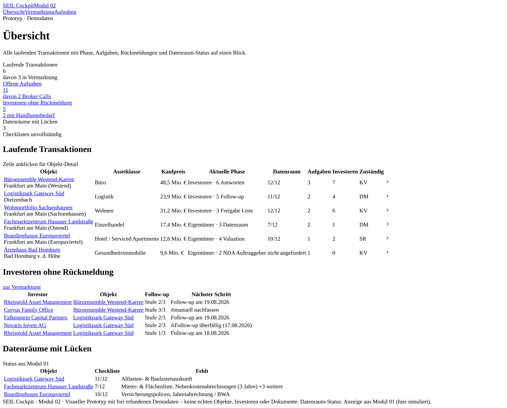
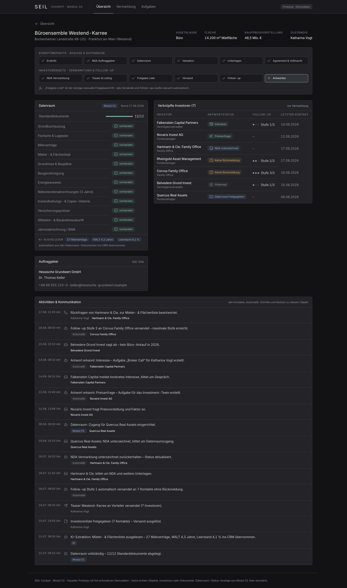
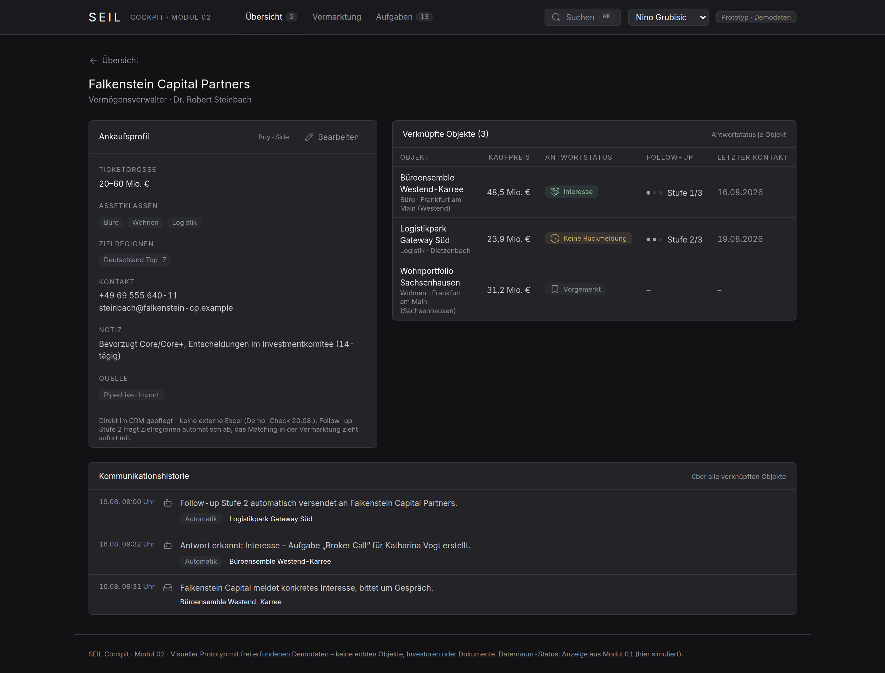
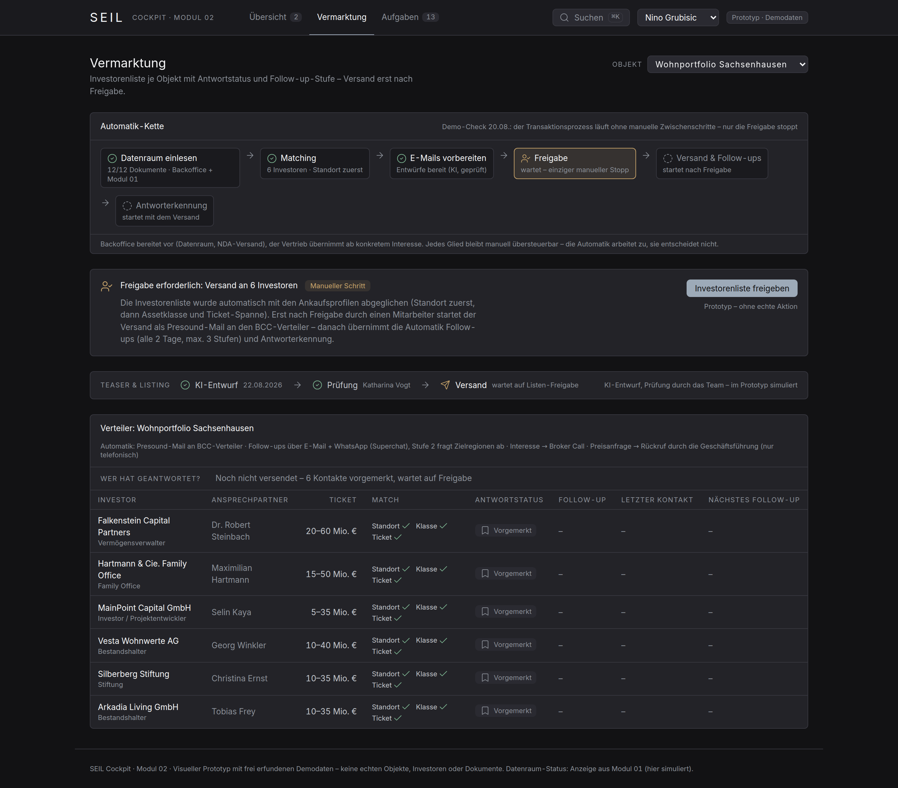
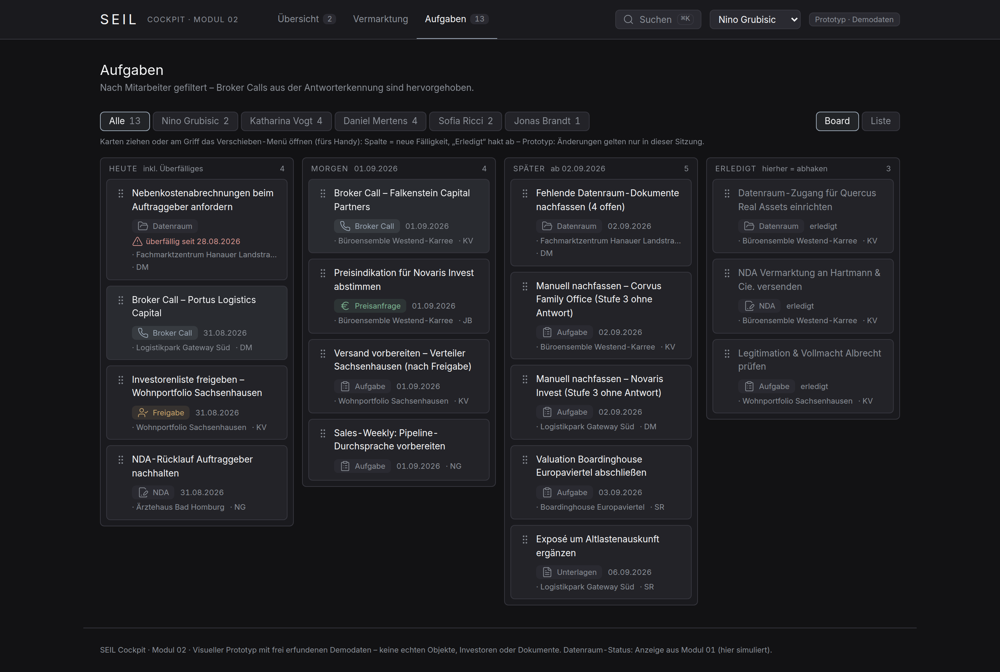
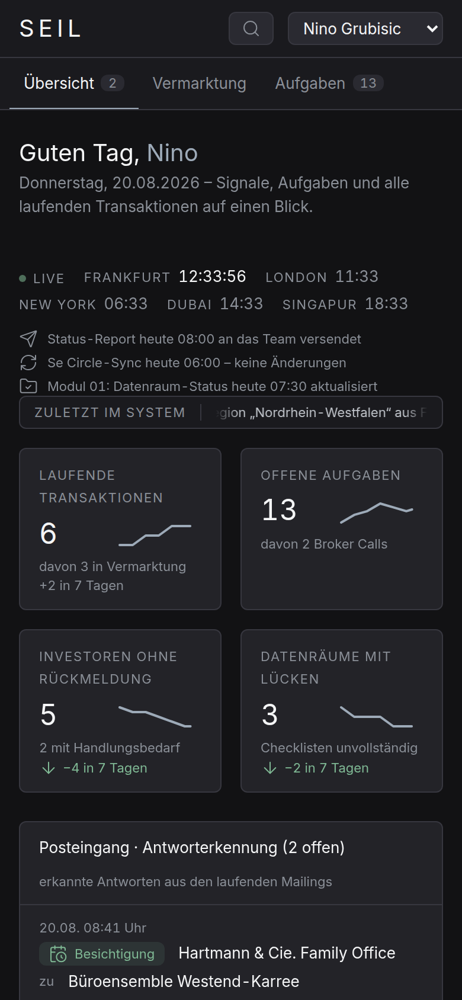
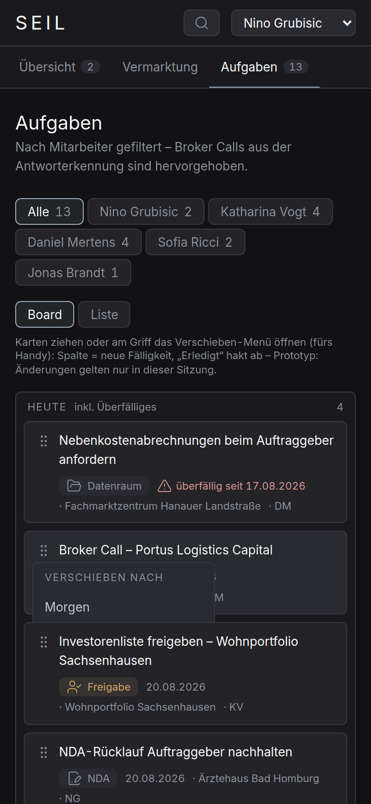

# SEIL Cockpit · Modul 02 (Prototyp)

Visueller Frontend-Prototyp (Klickdummy) für das SEIL Cockpit – das CRM-Cockpit einer
Immobilien-Transaktionsberatung. Der Prototyp dient der Abstimmung mit dem Kunden:
**keine echte Logik, keine API-Anbindung, keine Datenbank.** Alle Daten sind frei
erfundene Demodaten in [`lib/mock-data.ts`](lib/mock-data.ts).

Der Transaktionsprozess folgt der Team-Liste, bereinigt auf **26 Schritte in 4 Phasen** (Mandat & Bewertung → Vermarktungsvorbereitung → Aktive Vermarktung → Angebote & Reporting), Statusvokabular Done / In Progress / Pending / N.A. – die Bereinigungen gegenüber der Excel sind in [`ANNAHMEN.md`](ANNAHMEN.md) (Punkte 1–3) dokumentiert.

Kernidee: Objekte, Investoren und Auftraggeber sind **relational verknüpft** – jeder
Klick auf eine Entität zeigt alle verbundenen Aktivitäten, Kommunikation und
Gegenparteien. Genau das, was Pipedrive + Excel heute nicht können.

## Screens

| # | Screen | Route | Inhalt |
|---|--------|-------|--------|
| 1 | Übersicht | `/` | Laufende Transaktionen mit Phase, offene Aufgaben, Investoren ohne Rückmeldung, Datenräume mit Lücken |
| 2 | Objekt-Detail | `/objekte/[id]` | Prozessleiste über beide Seiten, Datenraum-Status (aus Modul 01), Dokumenten-Checkliste, verknüpfte Investoren, Aktivitäten |
| 3 | Investor-Detail | `/investoren/[id]` | Ankaufsprofil (Ticket, Assetklasse, Region), verknüpfte Objekte, Kommunikationshistorie |
| 4 | Vermarktung | `/vermarktung` | Investorenliste je Objekt, Antwortstatus je Kontakt, Follow-up-Stufe, oben der Freigabe-Schritt (Human-in-the-Loop) |
| 5 | Aufgaben | `/aufgaben` | Nach Mitarbeiter gefiltert, Broker Calls hervorgehoben |

Die Übersicht zeigt die laufenden Transaktionen wahlweise als dichte Tabelle
oder als Board – eine Spalte je Phase („Mandat & Bewertung“ bis „Angebote &
Reporting“).

Der Klickdummy ist als **tägliches Arbeitswerkzeug** gedacht (Pipedrive-Ablösung),
nicht als Berichtsseite: Oben rechts stellt „Arbeiten als“ das Cockpit auf die
Sicht eines Mitarbeiters um (simulierte Anmeldung). Die Übersicht beginnt mit dem
persönlichen Tag – dem **Posteingang der Antworterkennung** (erkannte Antworten
mit Triage per Klick) und **Meine Aufgaben** (direkt abhakbar, synchron mit dem
Aufgaben-Screen). **⌘K / Strg+K** öffnet die globale Suche über Objekte,
Investoren und offene Aufgaben. Der Aufgaben-Screen ist ein **Kanban-Board**
(Spalten = Fälligkeit: Heute, Morgen, Später, Erledigt) – Karten lassen sich
per Drag & Drop umplanen und abhaken; die Liste bleibt als zweite Ansicht. Dazu ist der Prototyp an den im Kickoff
gewünschten Stellen interaktiv: die Prozessleiste öffnet je Schritt ein
Detailpanel, KI-extrahierte Werte lassen sich prüfen und übernehmen, Notizen
lassen sich direkt am Objekt erfassen, Aufgaben lassen sich neu zuweisen,
verschieben und abhaken, und die Vermarktung zeigt Antwortquote und
Teaser-Pipeline (KI-Entwurf → Prüfung → Versand). Alle Eingriffe gelten nur in
der laufenden Sitzung – ein Reload stellt den Demostand wieder her.

Das Cockpit ist **responsiv**: Am Smartphone bricht die Kopfleiste in zwei
Zeilen, die Board-Spalten stapeln untereinander und breite Tabellen scrollen
innerhalb ihrer Karte. Weil Drag & Drop auf Touchscreens nicht existiert,
öffnet das Griff-Symbol jeder Board-Karte ein „Verschieben nach …“-Menü mit
gleicher Wirkung; die Suche öffnet mobil über das Lupen-Symbol
(ANNAHMEN.md, Punkt 41).

Objekt- und Investor-Detail sind bewusst nur über Verlinkungen erreichbar (Zeilen in
Tabellen anklicken) – es gibt keine Listen-Screens über die fünf Screens hinaus.

## Abdeckung Angebot AG2026-SEIL-03 & Kickoff (17.08.)

| Leistungsbaustein | Im Prototyp sichtbar als |
|---|---|
| KI-personalisierte Ansprache mit Freigabe-Workflow | Freigabe-Karte (Human-in-the-Loop); Versand im Prototyp als Presound-Sammelmail – Personalisierung je Investor ist Klärungspunkt (ANNAHMEN.md, Punkt 28) |
| Szenariobasierte Follow-up-Logik (Response, Price Inquiry, kein Rücklauf) | Antwortstatus je Kontakt, Follow-up-Stufen 1–3, „manuell nachfassen“ nach Stufe 3 |
| Antwort-Erkennung und Zuordnung | Aktivitäten „Antwort erkannt: …“ + automatisch erzeugte Aufgaben (Broker Call, Investment-Team) |
| Zentrales Dashboard: Phasen, Investoren, Objekte, Datenraum-Status | Die fünf Screens; Prozessleiste über beide Seiten; Datenraum aus Modul 01 |
| Pipedrive-Export/-Import (einmalig) | Quelle-Tag „Pipedrive-Import“ am Investor |
| Status-Reports an das Team | Statuszeile auf der Übersicht – Kanal bewusst offen |
| Se-Circle-Anbindung (Kickoff) | Quelle „Se Circle“ am Objekt + Sync-Aktivität |
| KI liest Datenraum aus (Grundbuch, Mieterlisten) | „KI-ausgelesen“-Kennwerte in der Datenraum-Karte + Aktivitäten mit Quelle „KI“ |
| KI generiert Teaser & Listings | Aktivität „Teaser und Listing automatisch generiert – zur Prüfung“ |
| Presound-Mails an BCC-Verteiler | Benennung in Freigabe-Karte und Automatik-Zeile der Vermarktung |

Alles davon ist reine Anzeige mit Demodaten – keine echte Automation im Prototyp.

### Screenshots

**Übersicht**


**Objekt-Detail**


**Investor-Detail**


**Vermarktung mit Freigabe-Schritt**


**Aufgaben**


**Mobil (390 px): Übersicht und Aufgaben-Board mit Verschieben-Menü**

<p>
  
  
</p>

## Start (lokal)

Voraussetzung: Node.js ≥ 18.18 (empfohlen: 22).

```bash
npm install
npm run dev
```

Dann <http://localhost:3000> öffnen.

Produktions-Build zum Testen:

```bash
npm run build
npm start
```

## Deploy (Vercel)

Der Prototyp ist ohne Konfiguration auf Vercel deploybar (keine Umgebungsvariablen,
kein Backend):

1. **Über das Vercel-Dashboard:** „Add New → Project“, dieses Repository importieren,
   Framework „Next.js“ wird automatisch erkannt – Deploy klicken.
2. **Oder per CLI:**
   ```bash
   npm i -g vercel
   vercel
   ```

## Projektstruktur

```
app/
  tokens.css               Design-Tokens – die einzige Stelle mit Hex-Werten
  globals.css              Tailwind-Einstieg, Inter-@font-face, Basis-Layer
  page.tsx                 Screen 1 – Übersicht
  objekte/[id]/page.tsx    Screen 2 – Objekt-Detail
  investoren/[id]/page.tsx Screen 3 – Investor-Detail
  vermarktung/page.tsx     Screen 4 – Vermarktung + Freigabe
  aufgaben/page.tsx        Screen 5 – Aufgaben
components/
  ui/                      Primitives: Button, Badge, Card, Table, Input, Select,
                           Tabs, Toast, EmptyState, StatusDot – alles baut darauf auf
  cockpit.tsx              Fachliche Bausteine (KPI-Kachel, Fortschritt, Statusbadge …)
  nav.tsx, seil-logo.tsx   Kopfleiste und Logo
  prozessleiste.tsx, aktivitaeten.tsx, *-client.tsx
tailwind.config.ts         Liest die Tokens – enthält selbst keine Farbwerte
lib/
  types.ts                 Datenmodell (Objekt, Investor, Auftraggeber, Verknüpfung …)
  mock-data.ts             Alle Demodaten – zentral kuratiert
  derive.ts                Anzeige-Helfer: KPIs & Listen werden aus den Daten abgeleitet
public/
  fonts/                   Inter (variabel, lokal gehostet – kein Google-CDN)
  seil-logo.png            Weiße Logo-Variante aus der Präsentationsvorlage
docs/screenshots/          Screenshots der fünf Screens
DESIGN.md                  Design-System: Palette, Typo, Abstände, Do's und Don'ts
```

## Leitplanken

- Keine echten SEIL-Daten, keine echten Investorennamen, keine Kundendokumente –
  alles frei erfunden (E-Mail-Domains enden auf `.example`). Einzige bewusste
  Ausnahme: Nino Grubisic (Leitung Sales) ist auf Wunsch als echter Nutzer für
  die Demo angelegt – ohne Kontaktdaten (ANNAHMEN.md, Punkt 16).
- Modul 01 (Datenraum-Automatik) ist **nicht** angebunden; der Datenraum-Status wird
  nur als Anzeige simuliert und ist entsprechend gekennzeichnet.
- Der Freigabe-Button in der Vermarktung ist eine reine UI-Demonstration.

Nutzungsleitfaden für das Team: siehe [`ANLEITUNG.md`](ANLEITUNG.md) –
auch als PDF zum Weitergeben: [`docs/SEIL-Cockpit-Anleitung.pdf`](docs/SEIL-Cockpit-Anleitung.pdf).

Offene Punkte für das Kundengespräch: siehe [`ANNAHMEN.md`](ANNAHMEN.md).

Design-System (Palette, Typografie, Abstände, Bausteine): siehe `DESIGN.md`.
